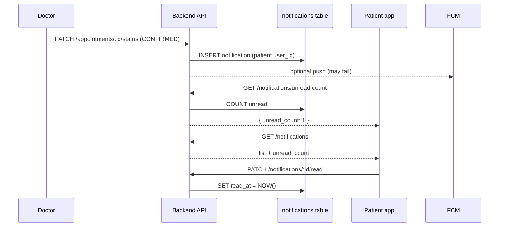

# In-App Notifications — Frontend Integration Guide

This document describes how the **Konsultify backend** stores and serves notifications for the notification bell / list UI. It is the primary way to show alerts in the app when **FCM push is disabled or unreliable**.

For FCM push (optional), see [`firebase-backend-notifications.md`](./firebase-backend-notifications.md).

---

## Overview

| Concept | Detail |
|---------|--------|
| **Storage** | MySQL table `notifications` |
| **Scope** | Per `users.id` (logged-in user) |
| **Creation** | Automatic on business events (book, confirm, reject, etc.) |
| **Read state** | `read_at` — `null` = unread |
| **Base URL** | `{VITE_BASE_URL}/notifications` → e.g. `http://localhost:3000/api/v1/notifications` |

Every backend call to `sendNotification()`:

1. **Always** inserts a row in `notifications` (in-app).
2. **Optionally** attempts FCM push (failures do not roll back the DB row).

The frontend does **not** create notifications via API (except the dev/test endpoint). It only **reads** and **marks read**.

---

## Architecture



---

## Database shape (reference)

| Column | Type | Description |
|--------|------|-------------|
| `id` | bigint | Notification id (use in mark-read URL) |
| `user_id` | bigint | Recipient `users.id` |
| `title` | string | Short heading (max 255 chars) |
| `body` | text | Full message |
| `type` | string | Machine-readable event id (routing) |
| `appointment_id` | bigint \| null | Related appointment, if any |
| `read_at` | datetime \| null | Set when read; `null` = unread |
| `created_at` | datetime | When the event occurred |

---

## Authentication

All endpoints require a valid JWT:

```http
Authorization: Bearer <access_token>
```

Use the same axios instance / `getAccessToken()` as the rest of the app (`VITE_BASE_URL`).

---

## API endpoints

### 1. List notifications

```http
GET /api/v1/notifications?page=1&limit=20&unread_only=false
Authorization: Bearer <access_token>
```

| Query | Type | Default | Description |
|-------|------|---------|-------------|
| `page` | int ≥ 1 | `1` | Page number |
| `limit` | int 1–50 | `20` | Items per page |
| `unread_only` | `true` \| `false` \| `1` \| `0` | — | If true, only unread rows |

**Response `200`:**

```json
{
  "data": [
    {
      "id": 12,
      "title": "Appointment Confirmed",
      "body": "Your appointment on 2026-05-30 at 10:00 has been confirmed.",
      "type": "appointment_confirmed",
      "appointment_id": 42,
      "is_read": false,
      "read_at": null,
      "created_at": "2026-05-29T14:30:00.000Z"
    }
  ],
  "unread_count": 3,
  "meta": {
    "page": 1,
    "limit": 20,
    "total": 15,
    "totalPages": 1,
    "hasNextPage": false,
    "hasPrevPage": false
  }
}
```

| Field | Notes |
|-------|--------|
| `data` | Newest first (`created_at` desc) |
| `unread_count` | Total unread for user (ignores `unread_only` filter) |
| `meta.total` | Total matching the current filter (`unread_only` affects this) |
| `is_read` | Derived from `read_at != null` |

**Errors:** `400` invalid query, `401` unauthorized.

---

### 2. Unread count (badge)

```http
GET /api/v1/notifications/unread-count
Authorization: Bearer <access_token>
```

**Response `200`:**

```json
{
  "unread_count": 3
}
```

Use on app load and after actions that may create notifications (poll or refetch after mutations).

---

### 3. Mark one notification as read

```http
PATCH /api/v1/notifications/:id/read
Authorization: Bearer <access_token>
```

`:id` = notification `id` from the list (positive integer).

**Response `200`:**

```json
{
  "success": true,
  "already_read": false
}
```

If already read:

```json
{
  "success": true,
  "already_read": true
}
```

**Errors:** `404` not found or belongs to another user, `400` invalid id.

---

### 4. Mark all as read

```http
PATCH /api/v1/notifications/read-all
Authorization: Bearer <access_token>
```

**Response `200`:**

```json
{
  "success": true,
  "updated_count": 5
}
```

---

### 5. Test notification (development)

```http
POST /api/v1/notifications/test-push
Authorization: Bearer <access_token>
```

Creates one in-app row for the **current user** and attempts FCM.

**Response `200`:** includes `success`, `message`, `tokensFound`, `successCount`, etc.

---

## FCM token routes (unchanged)

These are separate from the in-app list but live under the same router:

| Method | Path | Purpose |
|--------|------|---------|
| `POST` | `/notifications/register-token` | Body: `{ "token", "device_type": "web" }` |
| `POST` | `/notifications/unregister-token` | Body: `{ "token" }` |

In-app notifications work **without** registering FCM.

---

## Notification `type` values and recipients

When these events happen on the backend, a row is created for the **recipient** user.

| `type` | Recipient | Trigger |
|--------|-----------|---------|
| `appointment_booked` | Doctor | Patient books (`POST /appointments`) |
| `appointment_confirmed` | Patient | Doctor confirms (`PATCH /appointments/:id/status`) |
| `appointment_rejected` | Patient | Doctor rejects (`PATCH /appointments/:id/reject`) |
| `appointment_cancelled` | Doctor | Patient cancels (`PATCH /appointments/:id/cancel`) |
| `reminder` | Patient + doctor | Cron ~30 min before CONFIRMED appointment |
| `consultation_notes_available` | Patient | Doctor saves notes |
| `prescription_available` | Patient | Doctor saves prescription |
| `test_push` | Current user | `POST /notifications/test-push` |
| `general` | — | Fallback if `type` omitted in internal send |

---

## Suggested frontend routing (`type` → path)

Reuse the same mapping as FCM (if you have `notification-routes.ts`):

| `type` | Patient route | Doctor route |
|--------|---------------|--------------|
| `appointment_booked` | — | `/doctor/appointments` |
| `appointment_confirmed` | `/patient/appointments` | — |
| `appointment_rejected` | `/patient/appointments` | — |
| `appointment_cancelled` | — | `/doctor/appointments` |
| `reminder` | `/patient/appointments` | `/doctor/appointments` |
| `consultation_notes_available` | `/patient/medical-records` | — |
| `prescription_available` | `/patient/medical-records` | — |
| `test_push` | Dashboard or `/patient/appointments` | Same |

When `appointment_id` is set, you can deep-link to detail if those routes exist, e.g. `/patient/appointments/:appointmentId`.

---

## Recommended UI integration

### On login (protected layout)

```ts
// 1. Badge
const { data } = await api.get('/notifications/unread-count');
setBadge(data.unread_count);

// 2. Optional: prefetch first page when opening bell
const list = await api.get('/notifications', { params: { page: 1, limit: 20 } });
```

### Notification bell / dropdown

1. `GET /notifications?limit=20`
2. Render `title`, `body`, relative time from `created_at`
3. Style unread: `!is_read` (bold dot / background)
4. On item click:
   - `PATCH /notifications/:id/read`
   - Navigate via `type` + user role
   - Decrement local badge

### “Mark all as read”

```ts
await api.patch('/notifications/read-all');
setBadge(0);
refetchList();
```

### Polling vs refetch

| Approach | When |
|----------|------|
| Poll `unread-count` every 30–60s | Simple, no WebSocket |
| Refetch after mutations | Patient books → doctor dashboard refetch |
| Refetch on window focus | Catches cross-tab updates |
| FCM `onMessage` + refetch | Best UX when push works |

In-app list works even when FCM fails.

---

## TypeScript types (copy-paste)

```ts
export type NotificationType =
  | 'appointment_booked'
  | 'appointment_confirmed'
  | 'appointment_rejected'
  | 'appointment_cancelled'
  | 'reminder'
  | 'consultation_notes_available'
  | 'prescription_available'
  | 'test_push'
  | 'general';

export interface AppNotification {
  id: number;
  title: string;
  body: string;
  type: NotificationType | string;
  appointment_id: number | null;
  is_read: boolean;
  read_at: string | null;
  created_at: string;
}

export interface NotificationListResponse {
  data: AppNotification[];
  unread_count: number;
  meta: {
    page: number;
    limit: number;
    total: number;
    totalPages: number;
    hasNextPage: boolean;
    hasPrevPage: boolean;
  };
}

export interface UnreadCountResponse {
  unread_count: number;
}
```

---

## Example: React Query hooks

```ts
import { useQuery, useMutation, useQueryClient } from '@tanstack/react-query';
import api from '@/lib/axios';

export function useUnreadNotificationCount(enabled = true) {
  return useQuery({
    queryKey: ['notifications', 'unread-count'],
    queryFn: async () => {
      const { data } = await api.get<UnreadCountResponse>('/notifications/unread-count');
      return data.unread_count;
    },
    enabled,
    refetchInterval: 60_000,
    refetchOnWindowFocus: true,
  });
}

export function useNotifications(page = 1, unreadOnly = false) {
  return useQuery({
    queryKey: ['notifications', 'list', page, unreadOnly],
    queryFn: async () => {
      const { data } = await api.get<NotificationListResponse>('/notifications', {
        params: { page, limit: 20, unread_only: unreadOnly || undefined },
      });
      return data;
    },
  });
}

export function useMarkNotificationRead() {
  const qc = useQueryClient();
  return useMutation({
    mutationFn: (id: number) => api.patch(`/notifications/${id}/read`),
    onSuccess: () => {
      qc.invalidateQueries({ queryKey: ['notifications'] });
    },
  });
}

export function useMarkAllNotificationsRead() {
  const qc = useQueryClient();
  return useMutation({
    mutationFn: () => api.patch('/notifications/read-all'),
    onSuccess: () => {
      qc.invalidateQueries({ queryKey: ['notifications'] });
    },
  });
}
```

---

## What is *not* stored in `notifications`

| UI feedback | Source |
|-------------|--------|
| “Appointment confirmed” toast on **doctor** screen after confirm | Local React/Sonner from API response |
| “Booked successfully” on **patient** after booking | Local toast |

Those are **not** rows in `notifications`. Only the **recipient** gets a DB row (e.g. patient when doctor confirms).

---

## Testing checklist

1. Run migration: `npx prisma migrate deploy` (already applied if backend is up to date).
2. Restart backend after schema changes.
3. Log in as **patient** and **doctor** in two browsers.
4. Doctor confirms an appointment.
5. As **patient**: `GET /notifications` → should see `appointment_confirmed`.
6. `GET /unread-count` → `≥ 1`.
7. `PATCH /:id/read` → `is_read: true`, badge decreases.
8. `POST /test-push` while logged in → instant test row.

---

## Error handling

| Status | Meaning |
|--------|---------|
| `401` | Missing/expired JWT — redirect to login |
| `404` | Notification id invalid or not owned by user |
| `400` | Bad `page`, `limit`, or `id` param |

Network errors: show retry; data is eventually consistent after refresh.

---

## Backend file map (for debugging)

| File | Role |
|------|------|
| `prisma/schema.prisma` | `Notification` model |
| `src/repositories/notificationRepository.ts` | DB access |
| `src/services/inAppNotificationService.ts` | List / read logic |
| `src/services/notificationService.ts` | `sendNotification` → DB + FCM |
| `src/services/appointmentService.ts` | Appointment notifications |
| `src/services/consultationService.ts` | Notes / prescription notifications |
| `src/jobs/reminderJob.ts` | Reminder notifications |
| `src/api/routes/notifications.ts` | HTTP routes |
| `src/api/controllers/notificationController.ts` | Handlers |

---

## Quick reference

| Action | Request |
|--------|---------|
| List | `GET /api/v1/notifications` |
| Badge | `GET /api/v1/notifications/unread-count` |
| Read one | `PATCH /api/v1/notifications/:id/read` |
| Read all | `PATCH /api/v1/notifications/read-all` |
| Dev test | `POST /api/v1/notifications/test-push` |
