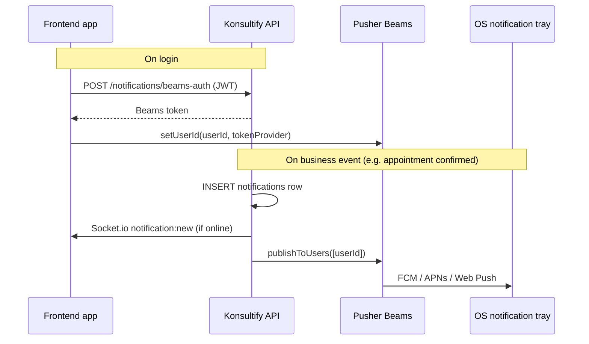
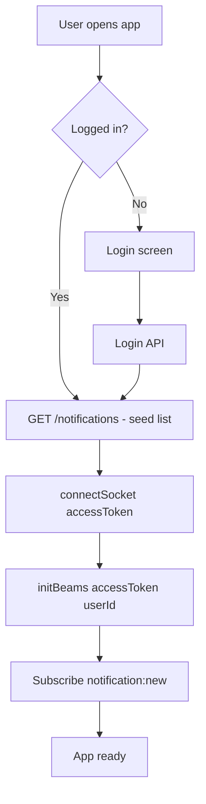

# Pusher Beams Push Notifications — Frontend Integration Guide

> **Purpose:** Native OS push notifications (app closed, backgrounded, or offline)  
> **Not for real-time in-app updates** — use Socket.io for that ([`socket-notifications-frontend.md`](./socket-notifications-frontend.md))  
> **In-app list / bell UI** — use REST API ([`in-app-notifications-frontend.md`](./in-app-notifications-frontend.md))

---

## Overview

Konsultify uses **three layers** for notifications. Each has a different job:

| Layer | Technology | When it runs | Frontend work |
|-------|------------|--------------|-----------------|
| **Persistence** | MySQL + REST | Always | List, badge, mark read |
| **Real-time (in-app)** | Socket.io | App open + connected | `notification:new` listener |
| **Native push** | Pusher Beams | App closed / background | Beams SDK + `setUserId` |

When the backend sends a notification, it always:

1. Saves a row to the database  
2. Emits `notification:new` via Socket.io (if connected)  
3. Publishes a push via Pusher Beams (if the device is registered)



---

## What you need from the backend team

| Item | Where | Safe in frontend? |
|------|--------|-------------------|
| **Instance ID** | Pusher Beams dashboard → Keys | Yes — public, use in client SDK |
| **Secret key (Primary key)** | Pusher dashboard | **No** — server only, never in frontend code |
| **API base URL** | e.g. `http://localhost:3000` | Yes |
| **User id** | JWT / auth state (`users.id`) | Yes — must match server format |

**User ID format:** The server uses `String(userId)` everywhere (e.g. user `2` → `"2"`). Your `setUserId` call must use the same string.

---

## Environment variables (frontend)

```env
# API (same as Socket.io / REST)
VITE_API_URL=http://localhost:3000

# Pusher Beams — Instance ID only (from dashboard)
VITE_PUSHER_BEAMS_INSTANCE_ID=347a89b4-4b3f-44c4-81ad-fe95a789a9d1
```

Do **not** put the Beams secret key in the frontend.

---

## Backend API (Beams-specific)

All endpoints require:

```http
Authorization: Bearer <access_token>
```

Base path: `{VITE_API_URL}/api/v1/notifications`

### POST `/api/v1/notifications/beams-auth`

Returns a short-lived Beams token so the client SDK can associate this device with the logged-in user.

**Request:** no body

**Response `200`:**

```json
{
  "token": "eyJhbGciOiJIUzI1NiIsInR5cCI6IkpXVCJ9..."
}
```

(Exact shape is returned by the Pusher server SDK; treat as opaque and pass to `setUserId`.)

**Errors:**

| Status | Meaning |
|--------|---------|
| `401` | Missing or invalid JWT |
| `503` | Beams not configured on server |

**When to call:** Automatically via `TokenProvider` when the Beams SDK calls `setUserId` — you do not need to call this manually on every page load unless you build a custom provider.

---

### POST `/api/v1/notifications/test-push`

Triggers a test notification (DB + Socket.io + Beams). Useful for debugging.

**Response `200`:**

```json
{
  "success": true,
  "online": false,
  "pushed": true,
  "message": "Test notification saved and push sent via Pusher Beams. No active Socket.io connection — in-app update on next load."
}
```

| Field | Meaning |
|-------|---------|
| `online` | User has an active Socket.io connection |
| `pushed` | Server attempted Beams publish (credentials configured) |

`pushed: true` does **not** guarantee the device received an OS notification — the device must be registered via `setUserId` first.

---

## Web integration

### 1. Install

```bash
npm install @pusher/push-notifications-web
```

Docs: [Pusher Beams Web SDK](https://pusher.com/docs/beams/getting-started/web/javascript/)

### 2. Service worker

The Web SDK requires a service worker file. Copy from the package or follow Pusher’s “Getting started” guide. Register it from your app entry (e.g. `main.tsx`).

### 3. Initialize + associate user on login

```ts
// lib/pusherBeams.ts
import * as PusherPushNotifications from '@pusher/push-notifications-web';

const instanceId = import.meta.env.VITE_PUSHER_BEAMS_INSTANCE_ID;
const apiUrl = import.meta.env.VITE_API_URL;

let beamsClient: PusherPushNotifications.Client | null = null;

export async function initBeams(accessToken: string, userId: number): Promise<void> {
  if (!instanceId) {
    console.warn('[Beams] VITE_PUSHER_BEAMS_INSTANCE_ID not set');
    return;
  }

  beamsClient = new PusherPushNotifications.Client({ instanceId });

  const tokenProvider = new PusherPushNotifications.TokenProvider({
    url: `${apiUrl}/api/v1/notifications/beams-auth`,
    headers: {
      Authorization: `Bearer ${accessToken}`,
    },
  });

  await beamsClient.start();
  await beamsClient.setUserId(String(userId), tokenProvider);
}

export async function clearBeams(): Promise<void> {
  if (beamsClient) {
    await beamsClient.stop();
    beamsClient.clearAllState();
    beamsClient = null;
  }
}
```

### 4. Call from auth flow

```ts
// After successful login (when you have accessToken + user.id)
import { initBeams, clearBeams } from '@/lib/pusherBeams';
import { connectSocket, disconnectSocket } from '@/lib/socket';

async function onLogin(accessToken: string, user: { id: number }) {
  connectSocket(accessToken);           // real-time in-app
  await initBeams(accessToken, user.id); // native push
}

async function onLogout() {
  await clearBeams();
  disconnectSocket();
}
```

### 5. Handle notification clicks (optional)

Use the Beams Web SDK listener to navigate when the user taps a notification (e.g. open appointment detail using `data.type` and `data.appointmentId` from the payload).

Push `data` fields sent by the server (string key/value):

| Key | Example | Use |
|-----|---------|-----|
| `type` | `appointment_confirmed` | Route mapping |
| `appointmentId` | `42` | Deep link |

---

## React Native / mobile

Use the platform SDK from Pusher:

| Platform | Package / doc |
|----------|----------------|
| Android | `com.pusher:push-notifications-android` |
| iOS | Pusher Beams iOS SDK |
| React Native | Community wrappers or native modules — follow [Pusher Beams mobile docs](https://pusher.com/docs/beams/getting-started/) |

Same pattern on mobile:

1. Initialize with **Instance ID** only  
2. On login: `setUserId(String(userId), tokenProvider)`  
3. `TokenProvider` → `POST {API_URL}/api/v1/notifications/beams-auth` with `Authorization: Bearer <token>`  
4. On logout: `clearAllState()` / equivalent  

**Dashboard setup (required for mobile):**

- Android: upload **FCM** credentials in Beams → Settings  
- iOS: upload **APNs** key or certificate in Beams → Settings  

Without these, `pushed: true` from the server test endpoint will not show notifications on physical devices.

---

## Recommended app startup flow



On logout: `clearBeams()` → `disconnectSocket()` → clear auth state.

---

## Token refresh

Access tokens expire (default **15 minutes**). When you refresh the JWT:

1. Update your HTTP client’s Bearer token  
2. **Reconnect Socket.io** with the new token (see [`socket-notifications-frontend.md`](./socket-notifications-frontend.md))  
3. **Re-run `setUserId`** with a `TokenProvider` that sends the new Bearer token (or call `clearBeams()` then `initBeams()` again)

Beams auth tokens from `/beams-auth` are valid for **24 hours**; the SDK refreshes them via `TokenProvider` as needed.

---

## Notification `type` values (routing)

Use the same routing table as in-app / Socket.io notifications:

| `type` | Patient route | Doctor route |
|--------|---------------|--------------|
| `appointment_booked` | — | `/doctor/appointments` |
| `appointment_confirmed` | `/patient/appointments` | — |
| `appointment_rejected` | `/patient/appointments` | — |
| `appointment_cancelled` | — | `/doctor/appointments` |
| `reminder` | `/patient/appointments` | `/doctor/appointments` |
| `consultation_notes_available` | `/patient/medical-records` | — |
| `prescription_available` | `/patient/medical-records` | — |
| `test_push` | Dashboard | Dashboard |

---

## TypeScript types

```ts
export interface BeamsAuthResponse {
  token: string;
}

export interface TestPushResponse {
  success: boolean;
  online: boolean;
  pushed: boolean;
  message: string;
}
```

---

## What NOT to do

| Don't | Why |
|-------|-----|
| Put Beams **secret key** in frontend | Server-only credential |
| Use Pusher **Channels** for notifications | Real-time is Socket.io on this project |
| Call `POST /notifications/register-token` | Removed — Beams manages device tokens |
| Expect push without `setUserId` | No device registered → no OS notification |
| Rely on push alone for in-app UI | Use Socket.io + REST for bell/list |

---

## Testing checklist

### Server (Postman)

1. `POST /api/v1/notifications/test-push` with valid JWT  
2. Expect `pushed: true`  
3. `GET /api/v1/notifications` — new row with `type: test_push`

### Frontend

1. Set `VITE_PUSHER_BEAMS_INSTANCE_ID` and `VITE_API_URL`  
2. Log in → confirm `setUserId` succeeds (no error in console)  
3. **Background or close the app/tab**  
4. Trigger test push from Postman (same user)  
5. OS notification should appear  
6. Open app → notification also in list via REST (and via Socket.io if connected)

### Troubleshooting

| Symptom | Likely cause |
|---------|----------------|
| `pushed: true` but no OS notification | Client never called `setUserId`, or app still in foreground (web may not show banner) |
| `503` on `/beams-auth` | Server missing `PUSHER_BEAMS_*` env vars |
| `401` on `/beams-auth` | Expired access token |
| Android/iOS no push | FCM/APNs not configured in Pusher dashboard |
| Web no push | Service worker not registered; browser permission denied |

---

## Related docs

| Document | Topic |
|----------|--------|
| [`socket-notifications-frontend.md`](./socket-notifications-frontend.md) | Real-time `notification:new` via Socket.io |
| [`in-app-notifications-frontend.md`](./in-app-notifications-frontend.md) | REST list, badge, mark read |

---

## Quick reference

| Action | Request / call |
|--------|----------------|
| Associate device | `POST /api/v1/notifications/beams-auth` (via Beams `TokenProvider`) |
| Register user on device | `beamsClient.setUserId(String(userId), tokenProvider)` |
| Clear on logout | `beamsClient.clearAllState()` |
| Dev test (server) | `POST /api/v1/notifications/test-push` |
| In-app list | `GET /api/v1/notifications` |
| Real-time event | Socket.io `notification:new` |
